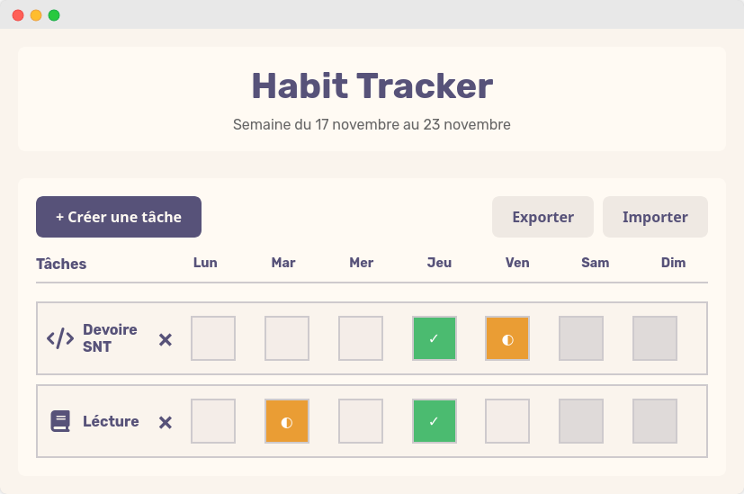

# Habit Tracker

A minimalist Progressive Web App (PWA) to track your daily habits with cloud sync and offline support with Vanilla JS.



## Features

- **Clean interface** - Minimalist design inspired by [Rosé Pine](https://rosepinetheme.com/) and [daisyUI](https://daisyui.com/)
- **Cloud sync** - Data automatically synchronized via Supabase
- **Offline mode** - Works without internet connection thanks to PWA
- **Multilingual** - Full support for French and English
- **Secure authentication** - OAuth (GitHub, Google) and Magic Links with Cloudflare Turnstile
- **Responsive** - Optimized for mobile, tablet and desktop
- **Weekly view** - Visualize your progress over 7 days
- **Data export** - Export your data as JSON (GDPR compliant)

## Installation

### Prerequisites

- A [Supabase](https://supabase.com) account (free tier available)
- A [Cloudflare](https://cloudflare.com) account for Turnstile (free)

### Setup

1. **Clone the repository**
```bash
git clone https://github.com/SquircleUnderscore/HabitTracker.git
cd tracker
```

2. **Configure Supabase**

Create a Supabase project and run this SQL to create the table:

```sql
-- Create habit_states table
CREATE TABLE habit_states (
  id UUID DEFAULT gen_random_uuid() PRIMARY KEY,
  user_id UUID NOT NULL REFERENCES auth.users(id) ON DELETE CASCADE,
  data JSONB NOT NULL,
  updated_at TIMESTAMP WITH TIME ZONE DEFAULT NOW(),
  created_at TIMESTAMP WITH TIME ZONE DEFAULT NOW()
);

-- Index for better performance
CREATE INDEX idx_habit_states_user_id ON habit_states(user_id);

-- Enable Row Level Security
ALTER TABLE habit_states ENABLE ROW LEVEL SECURITY;

-- RLS policies
CREATE POLICY "Users can view their own habit states"
  ON habit_states FOR SELECT
  USING (auth.uid() = user_id);

CREATE POLICY "Users can insert their own habit states"
  ON habit_states FOR INSERT
  WITH CHECK (auth.uid() = user_id);

CREATE POLICY "Users can update their own habit states"
  ON habit_states FOR UPDATE
  USING (auth.uid() = user_id);

CREATE POLICY "Users can delete their own habit states"
  ON habit_states FOR DELETE
  USING (auth.uid() = user_id);
```

3. **Configure API keys**

Edit `app.html` with your keys:

```javascript
const SUPABASE_URL = 'your-supabase-url';
const SUPABASE_ANON_KEY = 'your-supabase-anon-key';
```

Edit `app.html` with your Turnstile key:

```html
<div class="cf-turnstile" id="turnstileWidget" data-sitekey="your-turnstile-key"></div>
```

4. **Configure OAuth authentication**

In Supabase, go to **Authentication > Providers** and enable:
- GitHub OAuth
- Google OAuth

5. **Deploy**

Host the files on a web server (Vercel, Netlify, GitHub Pages, etc.)

## Privacy & GDPR

This project complies with GDPR (General Data Protection Regulation):

- Minimal data collection (email + habits)
- Right of access: data export as JSON
- Right to be forgotten: complete account deletion
- Transparency: privacy policy available
- Security: Supabase RLS, OAuth authentication

## Contributing

Contributions are welcome
For questions or suggestions: **root@squircle.computer**

---
